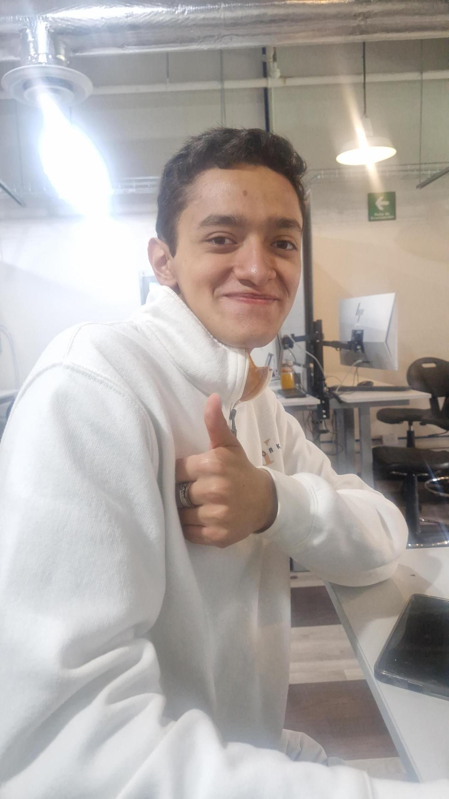

# Introducción a la mecatrónica
Bienvenido 👋  

   
  <b>Adrián</b>

### **Descripción personal**

Mi nombre es Jorge Adrián Pérez Fernández tengo 18 años, actualmente estoy estudiando Ingeniería mecatrónica, mis enfoques actuales serían la robotica y el control de programas.
Algo de lo cual me siento orgulloso es que cree con mis compañeros un huerto con regado e iluminación semiautomaticos para interiores

  - **Mis intereses son:**
    * Jugar videojuegos
      
    
    
    * Jugar Basquetbol
    
     
     
    * Leer varios géneros de libros
      
    

- ### **Información de contacto**
**Email:** 204560@iberopuebla.mx
 
 
 

   
  <b>Iker</b>

 

### **Descripción personal**

Hola soy Iker Antonio Barrios Rios tengo 18 años, actualmente estoy estudiando Ingeniería mecatrónica, mi principal enfoque esta en la electrónica programable( sensores y motores) aunque también me enfoco en la programación y en menor medida la mecánica, y me siento orgulloso por quedar en lugar no. 15 en la competenmcia nacional de Lego First 2023-2024

  - **Mis intereses son:**
    * Jugar videojuegos de gestión, supervivencia y estrategia
    
     
     
    * Me apasiona el beisbol, le voy a los pericos de puebla
      
     

- ### **Información de contacto**
**Email:** 202778@iberopuebla.mx

