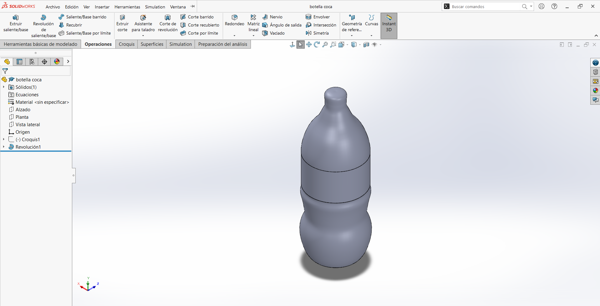

## **Semana 1**

Aprendimos a utilizar el progama de solidworks para hacer piezas u objetos en 3D a partir de planos 2D

<a href="../Syllabus/Botella.SLDPRT" target="_blank"> Botella Adrián</a>

    

<a href="../Iker/botellacoca.SLDPRT" target="_blank"> Botella Iker</a>

    

La herramienta principla que se utilizó fue "Revolución de saliente/base"

1.-Primero lo que hicimos fue insertar una imagen de la botella que queríamos dibujar

2.- Después colocamos un eje a la mita de la image

3.- Se usó "Spline" para ir dibujando por el contorno de la mitad de la figura 

4.- Ya por último con "Revolución de saliente/base" seleccionamos el eje central y ya se formó la figura