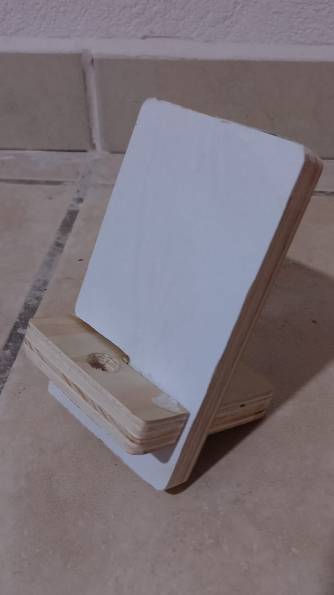
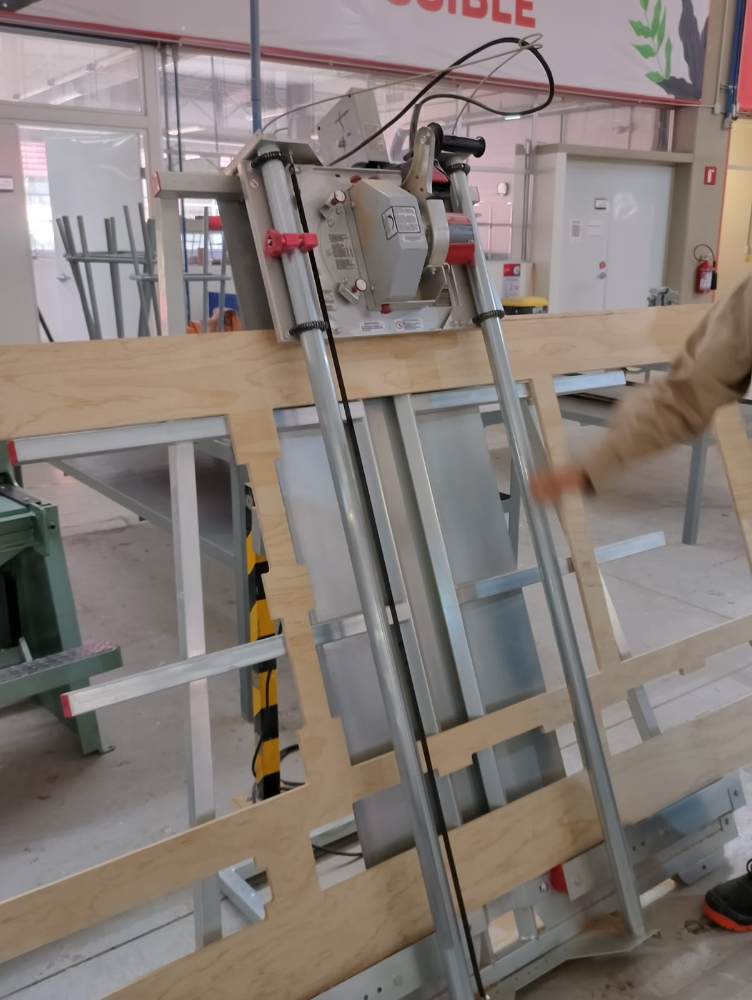
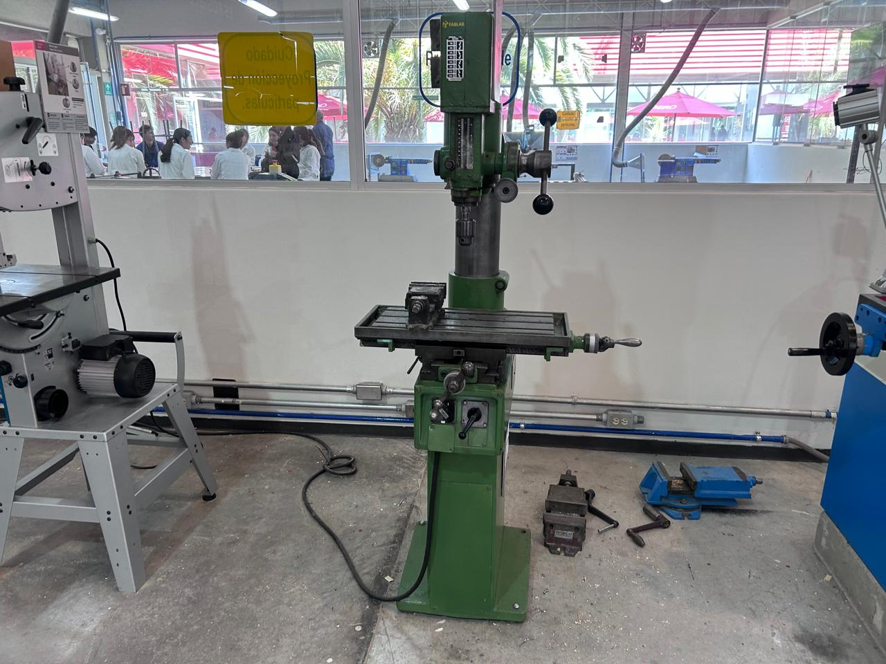
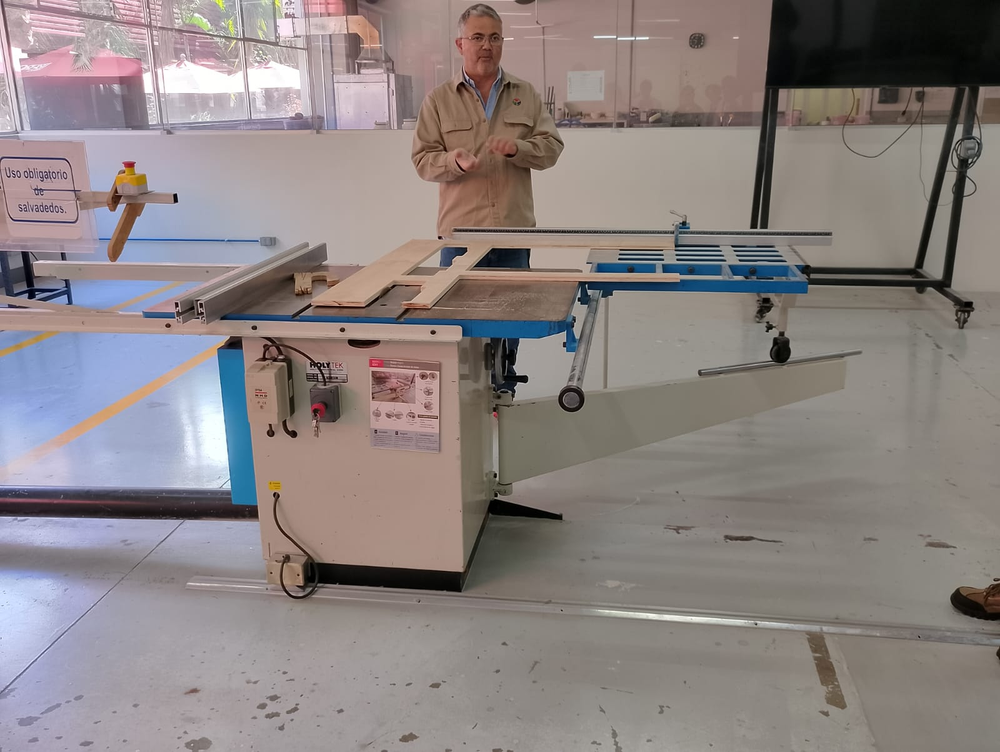
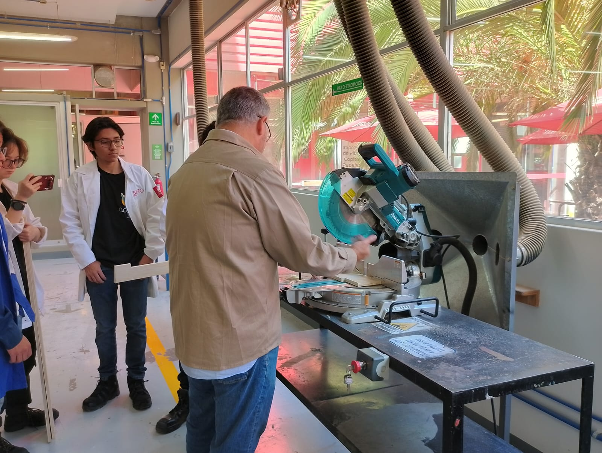
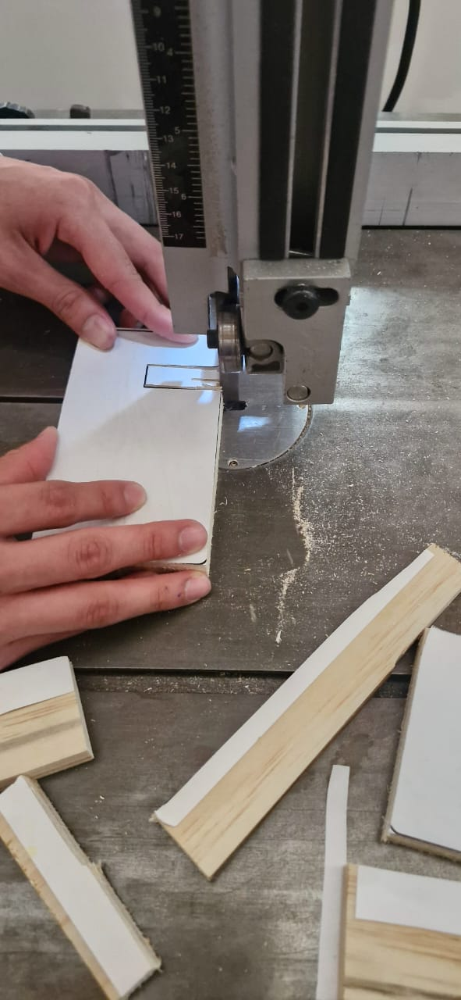
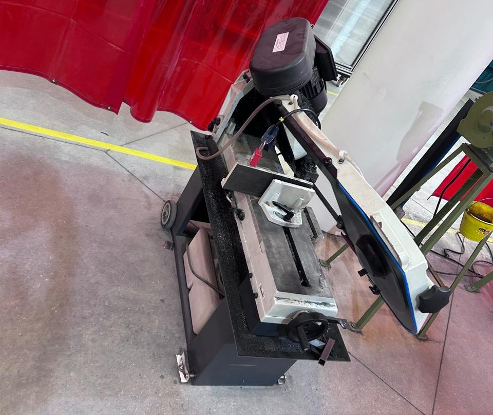
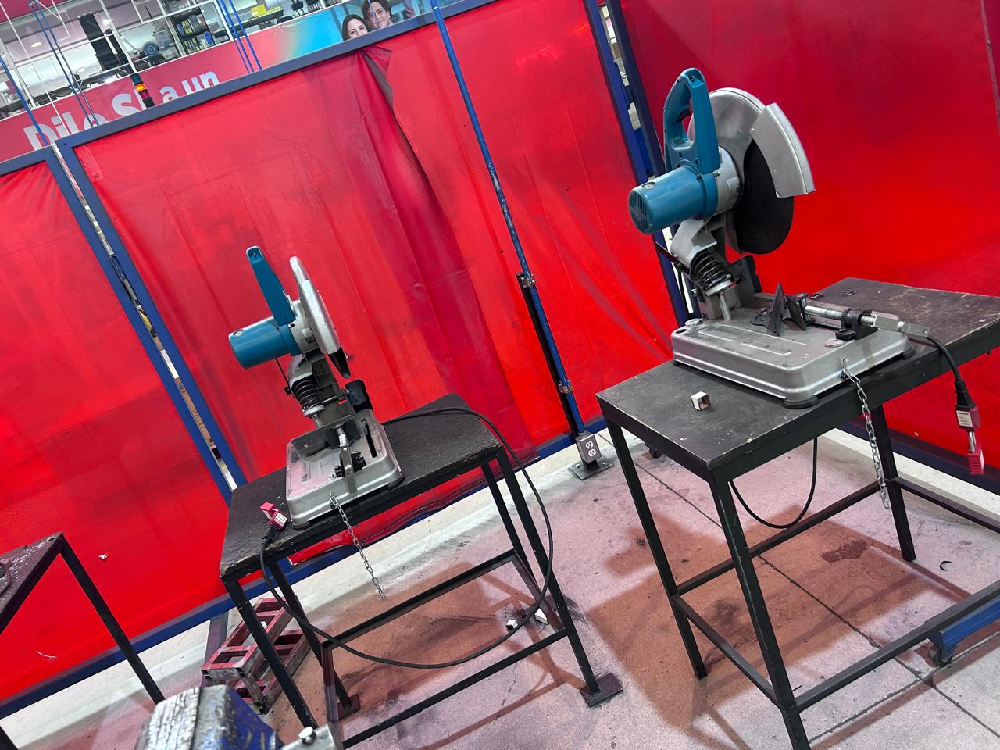

## **Semana 2** 

En el primer trabajo semanal realizamos lo que fue una base para teléfono hecha de madera

En este caso así fue cómo quedó la pieza ya terminada:

**Adrián**

    

**Iker** 

    

El equipo y herramientas que utilizamos para hacer la pieza fueron las siguientes:

### **Máquina de corte**

    

Está fue una de las máquinas que utilizamos principalmente para hacer los cortes, es una cierra delgada de metal que ayuda a hacer los cortes con facilidad, es para piezas de tamaño pequeñas

### **Taladro**

    

Está fue utilizada para hacer el orificio en la pieza donde se pueda pasar el cargador del telefono mientras está en la base, aquí se utilizan las brocas, de las cuales hay diferentes tamaños, depende que tan grande quieras hacer el orificio

### **Lijadora** 

    

Con está pudimos dar un borde redondo a todas las esquinas de la pieza 

### **Otras máquinas**

A lo largo de la clase también aprendimos a utilizar otras herramientas, por ejemplo sierras para cortar madera, generalmente piezas aún más grandes

|  |  |

    

Y para cortas piezas de metal

|  |  |
