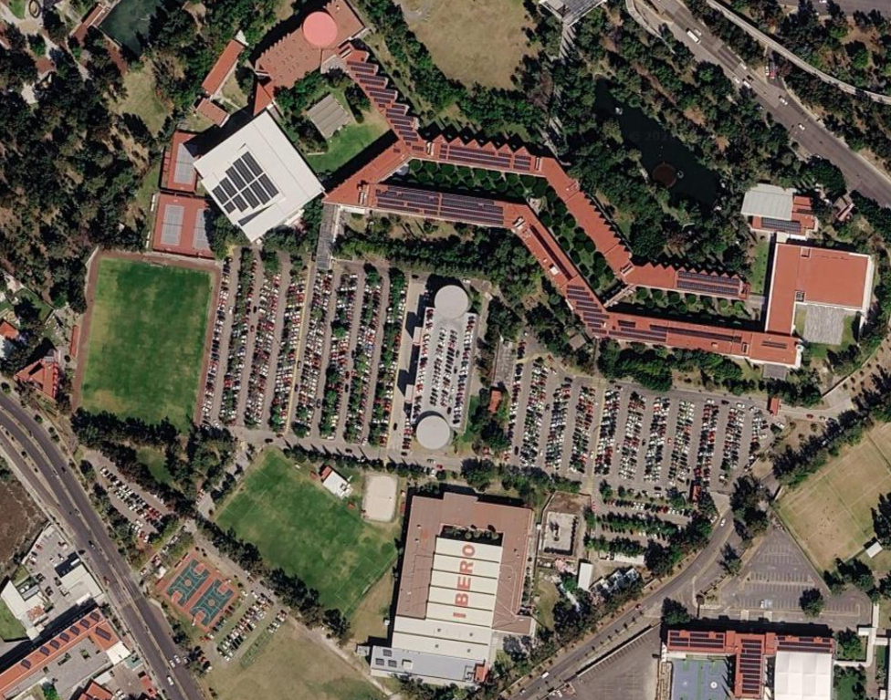

    

    

        

        Oficina Mecatrónica
    

    

        &times;
        <video id="reproductor" controls width="100%">
            <source src="vds/Oficina_Oliver1.mp4" type="video/mp4">
            Tu navegador no soporta la reproducción de videos.
        </video>
    

