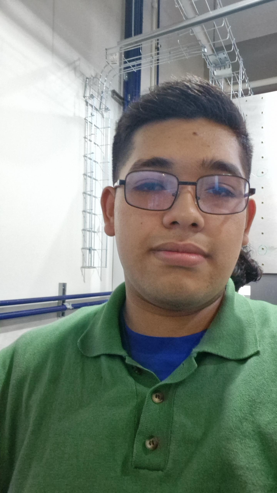

# Documentación del Proyecto de Adrian e Iker
Bienvenido 👋  

## **Adrián**


**Descripción personal**

  Mi nombre es Jorge Adrián Pérez Fernández, actualmente estoy estudiando Ingeniería mecatrónica, mis enfoques actuales serían la robotica y el control de programas.
  Algo de lo cual me siento orgulloso es que cree con mis compañeros un huerto con regado e iluminación semiautomaticos para interiores
  
**Mis interes son**:
  
*Jugar videojuegos
*Jugar Basquetbol
*Ir al gimnasio
*Leer varios géneros de libros 
    
     
## **Iker** 


### **Orgullosos de:**
- **Iker**
    * 15° lugar en la competenmcia nacional de Lego First 2023-2024
- **Adrián** 
    * Creación de huerto con regado e iluminación semiautomaticos para interiores

---

## Empezar rápido (3 pasos)

1. **Edita el nombre del sitio** en `mkdocs.yml`:
   ```yaml
   site_name: Documentación del Curso
   theme:
     name: material
